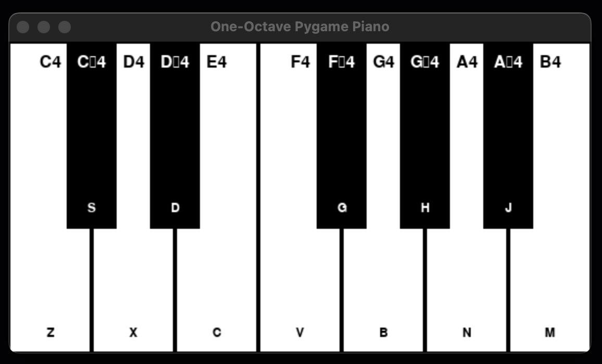
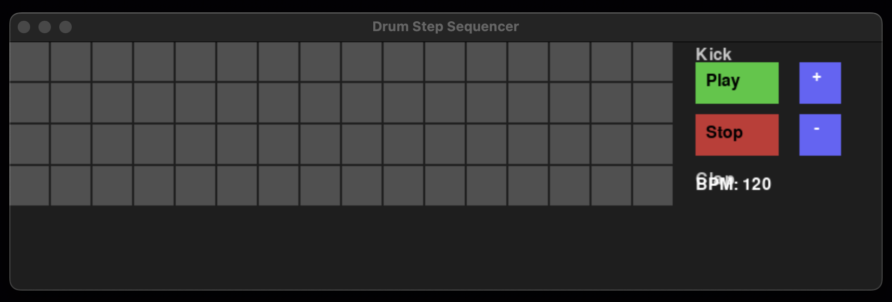

# Pygame Music Toolkit (In Development)

> **Note:** All tools are in active development. Features, UI, and behavior may change.

A suite of small Pygame + NumPy applications for musical experimentation:

## Applications

### 1. One-Octave Piano (`piano.py`)



- A playable keyboard spanning C4–B4 with black keys.
- **Controls:**
  - **Mouse:** Click/hold keys for polyphonic, sustained notes.
  - **Keyboard shortcuts:** Z/S/X/D/C/V/G/B/H/N/J/M mapping to respective notes.
- **Features:** Real-time key highlighting; customizable duration; sine-wave synthesis.

### 2. Procedural Piano (`progen.py`)

- Algorithmic melody generator using weighted random walks over the one-octave piano.
- Configurable tempo and note-duration weighting.
- **UI:** Highlights keys on-screen as notes play.

### 3. Drum Step Sequencer (`drum_sequencer.py`)



- 4-instrument (Kick, Snare, Hi-Hat, Clap) 16-step sequencer.
- **Controls:**
  - Toggle individual cells by clicking grid.
  - Play/Stop buttons for looping playback.
  - Live BPM adjustment (+ / –) between 30–300 BPM.
- **Visual Feedback:** Highlights current step and active beats.

## Dependencies

- **Python 3.7+**
- **Pygame**: Audio and GUI framework
- **NumPy**: Waveform and noise synthesis

Install in a virtual environment:

```bash
python3 -m venv .venv
source .venv/bin/activate
pip install pygame numpy
```

## Usage

Activate your virtual environment, then run any tool:

```bash
python piano.py        # Launch the one-octave piano
python progen.py       # Generate and visualize procedural melody
python drum_sequencer.py  # Open the drum step sequencer
```


Each script opens its own window with interactive controls. View the top of each file for specific key mappings and parameters.

## Development Roadmap its own window with interactive controls. View the top of each file for specific key mappings and parameters.

## Development Roadmap

- ✅ Core playback and UI for all tools
- 🔄 Save/load patterns (drum sequencer)
- 🎛️ Sample import and custom sounds
- ✨ ADSR envelopes & alternative waveforms (piano/procedural)
- 📊 Real-time visualizations (spectrum, piano roll)
- 🎚️ UI widgets (sliders, knobs) for parameter tweaking

